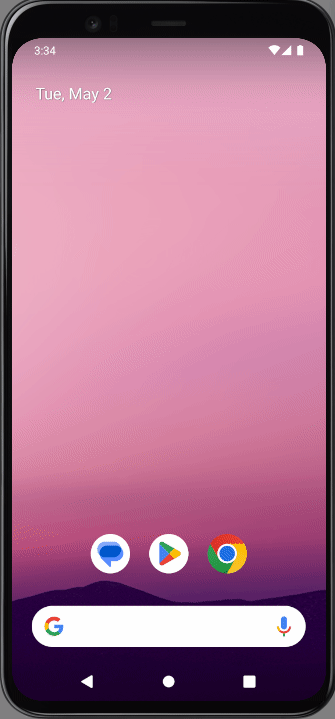
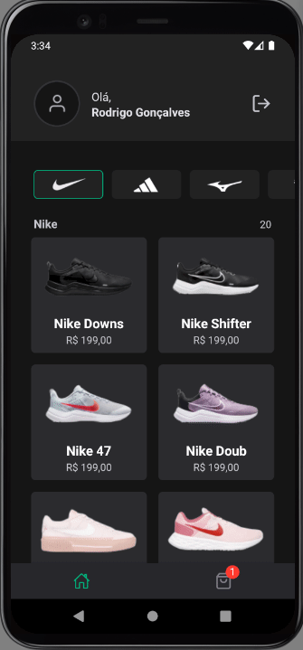

<h1 align="center">
    <p>Ignite shoes<p>
</h1>

## Demos


 


<br />

## About 
 
**Ignite shoes** is a project devloped in rocketseat classes.

In this app i've learned how to use firebase and one signal to make push notifications and deeplinking.

<br />

## Tools

- [Dotenv](https://github.com/goatandsheep/react-native-dotenv)
- [FireBase](https://firebase.google.com/?hl=pt-br)
- [ExpoDevBuild](https://docs.expo.dev/develop/development-builds/installation/#install-expo-dev-client)
- [OneSignal](https://documentation.onesignal.com/docs)
- [DeepLinking](https://reactnavigation.org/docs/deep-linking/)

<br />

## If you wanna try

<br />

<h3>Setup the .env variables, in this case you only gonna need oneSignal key</h3>

<br />

<h3>Mobile</h3>

```bash
    # Clone or Download Mobile Repository 
    $ git clone https://github.com/Renatoogata/React-Native-Aula04-Igniteshoes.git
``` 

```bash
    # Install the dependencies
    $ npm install
```

```bash
    # Run Prebuild
    $ npx expo prebuild
```

```bash
    # Run Android
    $ npx expo run:android
```

```bash
    # Run with Expo
    $ npx expo start --dev-client
```

<br />